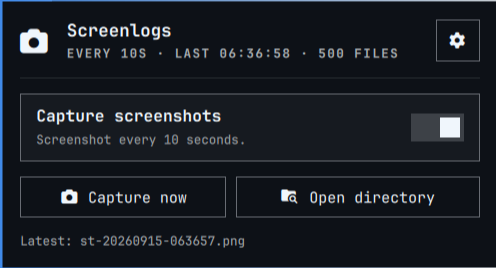
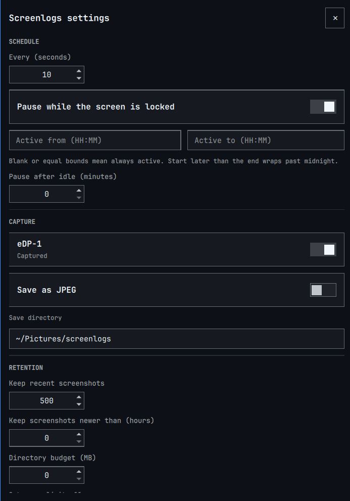

<div align="center">

# omarchy-screenlogs

**Periodic screen capture for Omarchy**

</div>

<hr>

<div align="center">
● <a href="#installation">Installation</a>  ● <a href="#preview">Preview</a>  ● <a href="#usage">Usage</a>  ● <a href="#configuration">Configuration</a>  ● <a href="#docs">Docs</a>  ● <a href="#license">License</a>
</div>

## Installation

```bash
omarchy plugin add https://github.com/FAZuH/omarchy-screenlogs.git --enable
```

## Preview

The panel (left click the camera icon):



The settings window (the gear in the panel):



## Usage

A camera icon appears on the bar:

| Input | Action |
|---|---|
| Left click | Open the panel: enable toggle, capture now, open directory, status |
| The gear (top right of the panel) | Open the settings window: schedule, monitors, format, retention |
| Middle click | Capture once, now |
| Right click | Pause / resume captures |

Captures pause automatically while the screen is locked, outside an optional
active-hours window, or after the session has been idle for N minutes.

Everything is also scriptable over the shell IPC:

```bash
omarchy-shell fazuh.screenlogs status    # state, last shot, directory, errors
omarchy-shell fazuh.screenlogs capture   # one screenshot now
omarchy-shell fazuh.screenlogs settings   # open / close the settings window
omarchy-shell fazuh.screenlogs disable   # pause
omarchy-shell fazuh.screenlogs enable    # resume (captures immediately)
```

## Configuration

Open the settings window (gear) to edit everything live. Settings are stored
in `~/.config/omarchy/screenlogs/config.json`.

See [Configuration reference](docs/configuration) for the full key reference.

## Docs

- [Configuration reference](docs/configuration.md) — every key with its meaning, range, and the pause and pruning semantics
- [Omarchy shell plugins](https://omarchy.org/manual/shell-plugins/) — how plugin kinds, entry points, and `shell.json` work
- Self-check: `node test.mjs` · Manifest check: `omarchy plugin validate .`

## License

[MIT](LICENSE)
